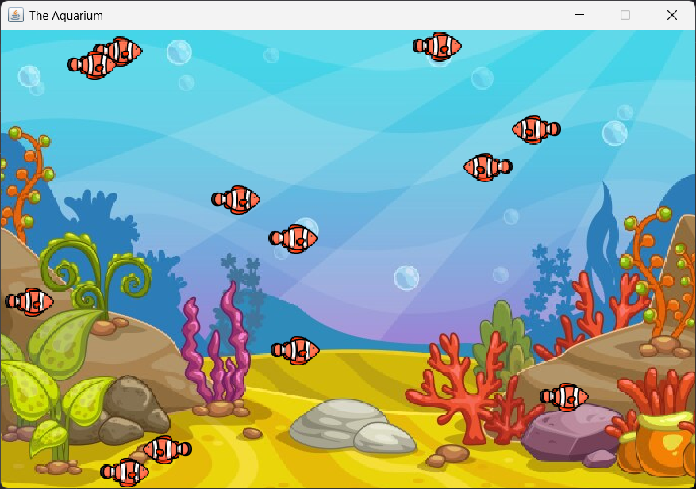

# Aquarium Simulation 🐟

A **Java-based interactive aquarium simulation** where fish swim around and can be fed by clicking on the screen. This project demonstrates the use of Java AWT for graphics, animation, and user interaction.

## Project Overview

This simulation creates a graphical window displaying an aquarium with multiple fish that move independently. Users can interact with the simulation by clicking anywhere on the screen to drop food, which the fish will swim toward. The project is built using Java's **Abstract Window Toolkit (AWT)** and demonstrates concepts like animation, event handling, and double-buffered graphics.

<p align="center">
  
</p>

## Features

- **Animated Fish**: fish swim with natural-looking movement patterns, including random direction changes and boundary detection.
- **Interactive Feeding**: click anywhere in the aquarium to drop food particles.
- **Food Detection**: fish detect and swim toward the nearest food source.
- **Hunger System**: fish have a hunger level, and if not fed, they will eventually die.
- **Smooth Animation**: double-buffered graphics ensure smooth and flicker-free animation.
- **Dynamic Status Updates**: displays messages when fish die due to hunger.

## Prerequisites

Before running the project, ensure you have the following installed:

- **Java Development Kit (JDK) 8 or higher**
- A terminal or command prompt to run the build script.

## How to Run

### Using the Build Script

1. **Clone the repository** (if applicable) or navigate to the project directory.
2. Run the build script to compile and execute the project:
   - **Windows**: run `.\build.bat` from the command prompt.
   - **Linux/macOS**: run `./build.sh` from the terminal.

### Manual Compilation and Execution

1. Compile the Java files:
   ```bash
   javac -d bin src/com/zadvornyi/aquarium/*.java
   ```
2. Run the application:
   ```bash
   java -cp bin com.zadvornyi.aquarium.Aquarium
   ```

## How to Use

- **Start the Simulation**: run the program, and a window will open displaying the aquarium with swimming fish.
- **Feed the Fish**: click anywhere in the aquarium to drop food, fish will detect and swim toward the food.
- **Monitor Fish Health**: fish have a hunger level indicated by a red dot above them when they are hungry. If not fed, they will die.
- **Exit the Program**: close the window to exit the simulation.

## Technical Details

- **Graphics**: uses Java AWT for rendering the aquarium, fish, and food.
- **Animation**: implements the `Runnable` interface to handle the animation loop.
- **Double Buffering**: prevents flickering by rendering frames off-screen before displaying them.
- **Event Handling**: mouse clicks are captured to drop food, and window events are handled for proper application termination.
- **Fish Behavior**:
  - Random movement with boundary detection.
  - Food detection and chasing behavior.
  - Hunger system that increases over time and decreases when food is eaten.
- **Food Behavior**: food particles fall at a consistent rate until they reach the bottom of the aquarium.

## Future Improvements

Here are some ideas for enhancing the simulation:

- Multiple Fish Types: add different types of fish with unique behaviors and appearances.
- Fish Reproduction: implement a breeding system where fish can reproduce under certain conditions.
- Decorative Elements: add bubbles, plants, and other aquarium decorations.
- Sound Effects: include background music and sound effects for feeding and fish movement.
- Configuration Options: allow users to adjust simulation parameters like fish speed, hunger rate, and food drop rate.

## License

This project is open-source and available under the MIT License.
